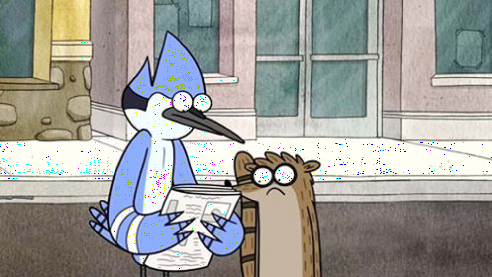
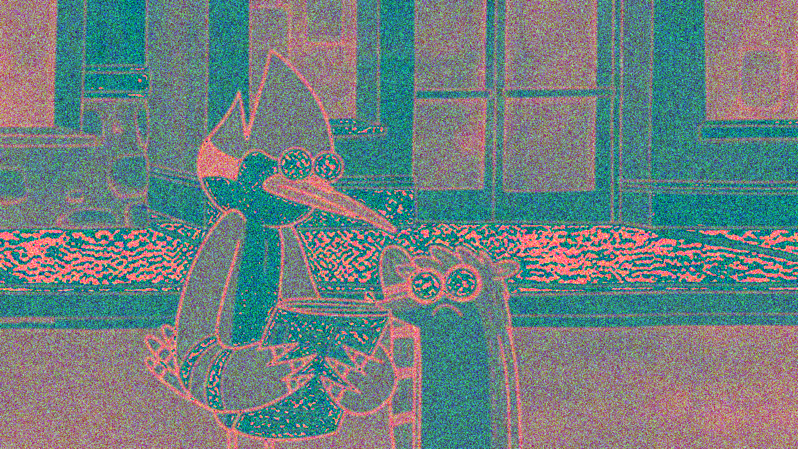

```{r setup, include=F}
library(png)
library(dplyr)
library(FactoMineR)
library(ica)
library(ggplot2)
library(patchwork)
knitr::opts_chunk$set(echo=T, cache=T)
```

## Wstęp

Za pomocą algorytmu PCA będę przekształcać obraz poniżej. ([źródło](https://twitter.com/RegularScreens/status/1271603018249768960))

```{r original}

```

## Proces

Zdjęcie ładuję za pomocą funkcji _readPNG_ z pakietu _PNG_. Zdecydowałem się na dwie metody przechowania obrazu:  
- pierwsza zakłada sklejenie kanału czerwonego, zielonego i niebieskiego w jedną macierz, o szerokości trzy razy dłuższej;  
- druga polega na połączeniu informacji o trzech kolorach w jedną; macierz zachowuje szerokość i wysokość, a w każdym jej elemencie znajduje się odwracalne przekształcenie 65536\*C+256\*Z+N.

```{r upload}
zdjecie_oryg <- readPNG("image.png")
rozmiar <- file.info("image.png")$size # rozmiar zdjęcia, przydatny później do porównania
he <- dim(zdjecie_oryg)[1] # wysokość
wi <- dim(zdjecie_oryg)[2] # szerokość
zdjecie1 <- cbind(zdjecie_oryg[,,1],
                  zdjecie_oryg[,,2],
                  zdjecie_oryg[,,3])
zdjecie2 <- round(65536*zdjecie_oryg[,,1]) + round(256*zdjecie_oryg[,,2]) + zdjecie_oryg[,,3]
```

### Metoda 1

Do przeprowadzenia PCA korzystam z funkcji _prcomp_ ze znanego nam już pakietu _FactoMineR_. Funkcja ta daje w wyniku wyliczone główne składniki (element _x_) oraz gotową macierz przekształcenia liniowego _W_ (element _rotation_). Kompresję przeprowadzam w zbudowanej przez siebie funkcji, ponieważ będę to robić dla różnej ilości używanych głównych komponentów. Efektem jej działania jest plik zapisany na podstawie macierzy.

```{r compression1}
kompresja1 <- function(img, komp, plik){
  pco <- prcomp(img, center=F)
  wys <- dim(img)[1]
  sze <- dim(img)[2]/3
  iks <- pco$x[, 1:komp]
  rot <- t(pco$rotation[, 1:komp])
  kompr0 <- (iks %*% rot)
  kompr <- array(dim=c(wys, sze, 3))
  kompr[,,1] <- kompr0[,1:sze]
  kompr[,,2] <- kompr0[,(sze+1):(sze*2)]
  kompr[,,3] <- kompr0[,(sze*2+1):(sze*3)]
  writePNG(kompr, target=plik)
}
```

Przedstawię kompresje dla 8 ilości PC-sów: 1 komponent (\~0,3\%), 1\% komponentów, 5\%, 10\%, 25\%, 50\%, 75\% i 100\% komponentów.

```{r c1_01}
kompresja1(zdjecie1, 1, "compressions/comp1_00.png")

```

```{r c1_1}
kompresja1(zdjecie1, he/100, "compressions/comp1_01.png")

```

```{r c1_5}
kompresja1(zdjecie1, he/20, "compressions/comp1_05.png")

```

```{r c1_10}
kompresja1(zdjecie1, he/10, "compressions/comp1_10.png")

```

```{r c1_25}
kompresja1(zdjecie1, he/4, "compressions/comp1_25.png")

```

```{r c1_50}
kompresja1(zdjecie1, he/2, "compressions/comp1_50.png")

```

```{r c1_75}
kompresja1(zdjecie1, he*3/4, "compressions/comp1_75.png")
knitr::include_graphics("compressions/comp1_75.png")
```

```{r c1_100}
kompresja1(zdjecie1, he, "compressions/comp1_100.png")

```

Już przy użyciu 1\% komponentów prawie daje się rozpoznać postacie. Nie ulega jednak wątpliwości, że do uzyskania wyższej jakości potrzeba więcej komponentów - dopiero od 50\% uzyskujemy idealne przetworzenie.

Jak do tego ma się rozmiar plików (w stosunku do oryginału)?

```{r sizes1}
percs <- c("1 komp.", "1%", "5%", "10%", "25%", "50%", "75%", "100%")
filep <- c("00", "01", "05", "10", "25", "50", "75", "100")
for (i in 1:8){
  print(paste(percs[i], ": ",
              file.info(paste("compressions/comp1_", filep[i], ".png", sep=""))$size/rozmiar*100, "%",
              sep=""), quote=F)
}
```

Dość niespodziewanie, nie jest on proporcjonalny w stosunku do liczby PC. Najwyższy rozmiar (94\% oryginału) jest osiągany dla 1/10 (konkretnie 84) komponentów, a potem spada ku poziomowi 77,5\%.

### Metoda 2

Wszystko odbywa się tak samo, tylko tym razem lekko zmodyfikujemy funkcję z uwagi na przechowanie kanałów w obrazie.

```{r compression2}
kompresja2 <- function(img, komp, plik){
  pco <- prcomp(img, center=F)
  wys <- dim(img)[1]
  sze <- dim(img)[2]
  iks <- pco$x[, 1:komp]
  rot <- t(pco$rotation[, 1:komp])
  kompr0 <- (iks %*% rot)
  kompr <- array(dim=c(wys, sze, 3))
  kompr[,,1] <- round(kompr0/256-0.5)
  kompr[,,2] <- round(kompr0%%256-0.5)
  kompr[,,3] <- round(256*(kompr0%%1)-0.5)
  writePNG(kompr, target=plik)
}
```

```{r c2_01}
kompresja2(zdjecie2, 1, "compressions/comp2_00.png")

```

```{r c2_1}
kompresja2(zdjecie2, he/100, "compressions/comp2_01.png")

```

```{r c2_5}
kompresja2(zdjecie2, he/20, "compressions/comp2_05.png")

```

```{r c2_10}
kompresja2(zdjecie2, he/10, "compressions/comp2_10.png")

```

```{r c2_25}
kompresja2(zdjecie2, he/4, "compressions/comp2_25.png")

```

```{r c2_50}
kompresja2(zdjecie2, he/2, "compressions/comp2_50.png")

```

```{r c2_75}
kompresja2(zdjecie2, he*3/4, "compressions/comp2_75.png")

```

```{r c2_100}
kompresja2(zdjecie2, he, "compressions/comp2_100.png")

```

Kolory są niepodobne od oryginalnych i nawet w ostatnim przypadku jakość w pewnym stopniu szwankuje. Zasadniczo jednak metoda przechowania kolorów w jednej liczbie przydałaby się jako ciekawy, być może nawet humorystyczny filtr graficzny. Znowu ciekawie prezentuje się porównanie rozmiarów:

```{r sizes2}
for (i in 1:8){
  print(paste(percs[i], ": ",
              file.info(paste("compressions/comp2_", filep[i], ".png", sep=""))$size/rozmiar*100, "%",
              sep=""), quote=F)
}
```

Wszystkie zdjęcia poza ostatnim mają trochę ponad dwukrotnie większy rozmiar (i ponownie nie wykazują proporcji z komponentami), wówczas gdy przekształcenie ze stoma procent komponentów jako jedyne zachowuje mniej danych.

# Zadanie dodatkowe

## Wstęp

Poprzez ICA naprawiamy pomiary z pliku _signals.tsv_.

```{r tsv}
sygnaly <- read.csv("../../signals.tsv", header=T, sep="\t")
p1 <- ggplot(sygnaly, aes(x=time)) + geom_point(aes(y=signal1), color="blue") + labs(x="time", y="signal 1")
p2 <- ggplot(sygnaly, aes(x=time)) + geom_point(aes(y=signal2), color="red") + labs(x="time", y="signal 2")
p3 <- ggplot(sygnaly, aes(x=time)) + geom_point(aes(y=signal3), color="green") + labs(x="time", y="signal 3")
p4 <- ggplot(sygnaly, aes(x=time)) + geom_point(aes(y=signal4), color="black") + labs(x="time", y="signal 4")
(p1+p2)/(p3+p4)
```

Dostępne są trzy metody ICA: _icafast_, _icaimax_, _icajade_. Przetestujmy wszystkie:

```{r ica_fun}
icaresult <- function(f){
  icamatrix <- f(sygnaly[, 2:5], 4)
  sygnaly2 <- as.data.frame(cbind(sygnaly$time, icamatrix$S))
  colnames(sygnaly2) <- colnames(sygnaly)
  p1 <- ggplot(sygnaly2, aes(x=time)) + geom_point(aes(y=signal1), color="blue") + labs(x="time", y="signal 1")
  p2 <- ggplot(sygnaly2, aes(x=time)) + geom_point(aes(y=signal2), color="red") + labs(x="time", y="signal 2")
  p3 <- ggplot(sygnaly2, aes(x=time)) + geom_point(aes(y=signal3), color="green") + labs(x="time", y="signal 3")
  p4 <- ggplot(sygnaly2, aes(x=time)) + geom_point(aes(y=signal4), color="black") + labs(x="time", y="signal 4")
  (p1+p2)/(p3+p4)
}
icaresult(icafast)
icaresult(icaimax)
icaresult(icajade)
```

Wszystkie te metody sugerują różne pomiary sygnałów. Co ciekawe, pomiary uzyskane po _icaimax_ w zasadzie wyglądają tak jak te po _icafast_, tylko pomnożone przez -1.

## Oświadczenie

_Oświadczam, że niniejsza praca stanowiąca podstawę do uznania osiągnięcia efektów uczenia się z przedmiotu **Wstęp do uczenia maszynowego** została wykonana przeze mnie samodzielnie._