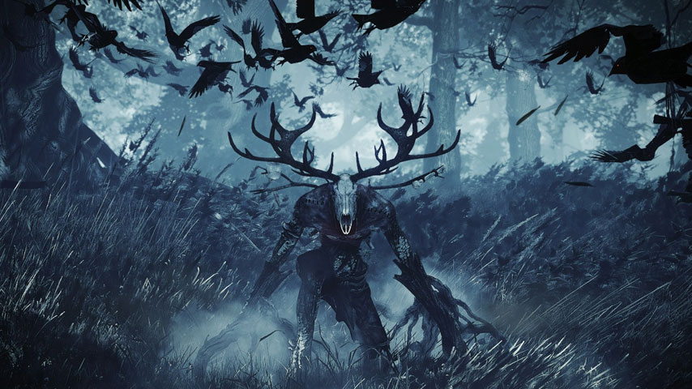

```{r setup, include=FALSE}
knitr::opts_chunk$set(echo = TRUE)
knitr::opts_chunk$set(warning = FALSE)
knitr::opts_chunk$set(cache = TRUE)
knitr::opts_chunk$set(message = FALSE)
```

```{r}
library(tidyverse)
library(jpeg)
```

## Oryginalny obrazek



## Wczytywanie obrazka

Wczytuję obrazek z pliku i konwertuję go do postaci macierzy

```{r}
img <- readJPEG("leshen.jpg")

r <- img[,,1]
g <- img[,,2]
b <- img[,,3]

img_comb <- cbind(r,g,b)
```

## PCA

Używam funkcji prcomp na macierzy.

```{r}
img_pca <- prcomp(img_comb, center = F)
```

Z wyjściowego obiektu wyjmuję macierze rotation oraz x, z których wybiorę potem najważniejsze komponenty.

```{r}
data_x <- img_pca$x 
data_rot <- img_pca$rotation
```

Po wymnożeniu tych macierzy odpowiednio przez siebie można otrzymać z powrotem wyjściowy obraz bez utraty jakości.

Ich rozmiary są następujące:

```{r}
dim(data_x)
dim(data_rot)
```

Łączna liczba elementów:

```{r}
length(as.vector(data_x)) + length(as.vector(data_rot))
```

## Funkcja do zapisu jpg

Za pomocą tej funkcji tworzę obrazy z powstałych macierzy.

```{r}
save.jpg <- function(mat, num) {
  r <- mat[,1:(ncol(mat)/3)]
  g <- mat[,((ncol(mat)/3)+1):(2*(ncol(mat)/3))]
  b <- mat[,(2*(ncol(mat)/3)+1):ncol(mat)]
  
  img <- array(c(r,g,b))
  dim(img) <- c(480,854,3)
  
  # dla obrazu o wymiarach 480x854
  
  name <- paste("obraz",num, ".jpg", sep = "")
  
  writeJPEG(img, name, quality = 1)
}
```


## Kompresja

Spróbuję zatem zredukować wymiary. 

### 1 komponent

```{r}
comp_x_1 <- as.array(data_x[,1])
comp_rot_1 <- as.array(data_rot[,1])
uncomp_1 <- comp_x_1 %*% t(comp_rot_1)
```

Redukuję obrazek do jednego najważniejszego komponentu.
Macierze stają się wektorami. W tym momencie redukuję rozmiar potrzebnych danych **480** razy.

Łączna liczba elementów:

```{r}
length(as.vector(comp_rot_1)) + length(as.vector(comp_x_1))
```

Jednak jakość obrazka mocno na tym ucierpiała (delikatnie mówiąc).

```{r}
save.jpg(uncomp_1, 1)
```


### 3 komponenty

```{r}
comp_x_3 <- data_x[,1:3]
comp_rot_3 <- data_rot[,1:3]
uncomp_3 <- comp_x_3 %*% t(comp_rot_3)
```

Redukuję obrazek do trzech najważniejszych komponentów.
Redukcja rozmiaru to w tym wypadku **160** razy.

Łączna liczba elementów:

```{r}
length(as.vector(comp_rot_3)) + length(as.vector(comp_x_3))
```

Niestety jakość nie jest dużo lepsza niż poprzednio.

```{r}
save.jpg(uncomp_3, 3)
```


### 10 komponentów

```{r}
comp_x_10 <- data_x[,1:10]
comp_rot_10 <- data_rot[,1:10]
uncomp_10 <- comp_x_10 %*% t(comp_rot_10)
```

Redukuję obrazek do dziesięciu najważniejszych komponentów.
Redukcja rozmiaru to w tym wypadku **48** razy.

Łączna liczba elementów:

```{r}
length(as.vector(comp_rot_10)) + length(as.vector(comp_x_10))
```

Obraz cały czas wygląda jak mozaika, pojawiają się również czerwone plamy.

```{r}
save.jpg(uncomp_10, 10)
```


### 20 komponentów

```{r}
comp_x_20 <- data_x[,1:20]
comp_rot_20 <- data_rot[,1:20]
uncomp_20 <- comp_x_20 %*% t(comp_rot_20)
```

Redukuję obrazek do dwudziestu najważniejszych komponentów.
Redukcja rozmiaru to w tym wypadku **24** razy.

Łączna liczba elementów:

```{r}
length(as.vector(comp_rot_20)) + length(as.vector(comp_x_20))
```

Widoczny jest zarys kształtu, ale cały czas można zaobserwować czerwone plamy.

```{r}
save.jpg(uncomp_20, 20)
```


### 40 komponentów

```{r}
comp_x_40 <- data_x[,1:40]
comp_rot_40 <- data_rot[,1:40]
uncomp_40 <- comp_x_40 %*% t(comp_rot_40)
```

Redukuję obrazek do czterdziestu najważniejszych komponentów.
Redukcja rozmiaru to w tym wypadku **12** razy.

Łączna liczba elementów:

```{r}
length(as.vector(comp_rot_40)) + length(as.vector(comp_x_40))
```

Widać już dobrze zarys kształtu stworzenia z obrazka.

```{r}
save.jpg(uncomp_40, 40)
```


### 120 komponentów

```{r}
comp_x_120 <- data_x[,1:120]
comp_rot_120 <- data_rot[,1:120]
uncomp_120 <- comp_x_120 %*% t(comp_rot_120)
```

Redukuję obrazek do stu dwudziestu najważniejszych komponentów.
Redukcja rozmiaru to w tym wypadku **4** razy.

Łączna liczba elementów:

```{r}
length(as.vector(comp_rot_120)) + length(as.vector(comp_x_120))
```

Obrazek jest już tylko trochę niewyraźny.

```{r}
save.jpg(uncomp_120, 120)
```


### 240 komponentów

```{r}
comp_x_240 <- data_x[,1:240]
comp_rot_240 <- data_rot[,1:240]
uncomp_240 <- comp_x_240 %*% t(comp_rot_240)
```

Redukuję obrazek do dwustu czterdziestu najważniejszych komponentów.
Redukcja rozmiaru to w tym wypadku **2** razy.

Łączna liczba elementów:

```{r}
length(as.vector(comp_rot_240)) + length(as.vector(comp_x_240))
```

Właściwie nie widać już różnicy w stosunku do oryginału.

```{r}
save.jpg(uncomp_240, 240)
```

**Po konwersji:**


**Oryginał:**


(Leszy - Wiedźmin 3 Dziki Gon)

