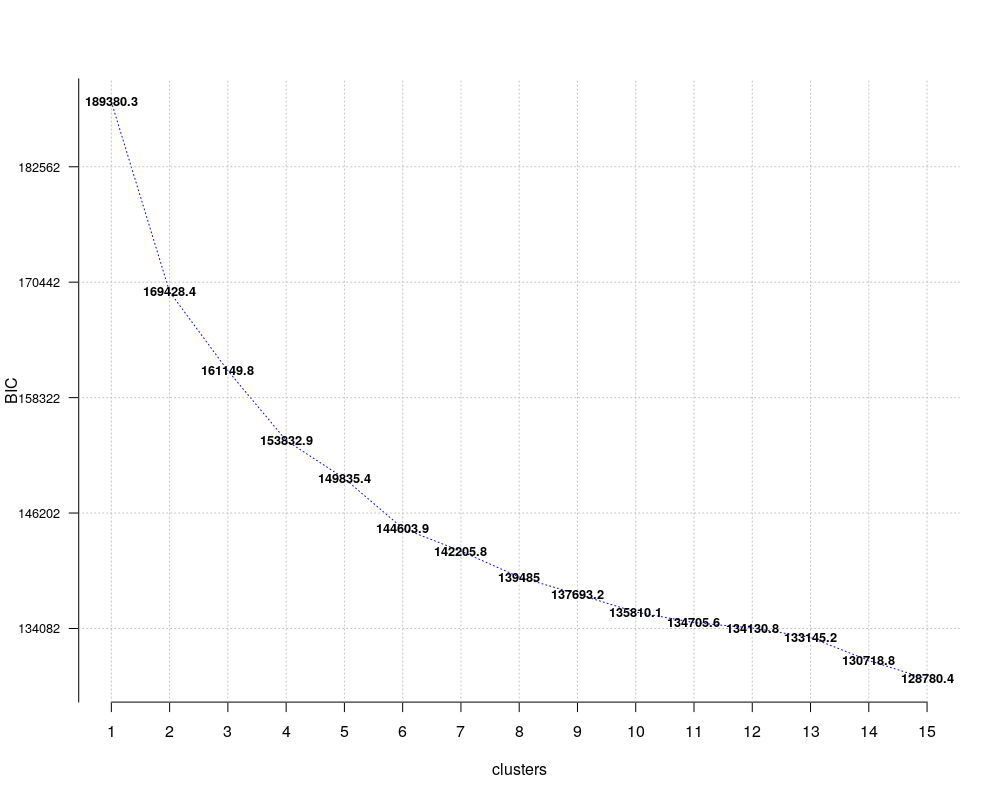

```{r setup, include=FALSE}
library(knitr)
knitr::opts_chunk$set(echo = TRUE, cache = TRUE, eval = TRUE)

hook_output <- knit_hooks$get("output")
knit_hooks$set(output = function(x, options) {
  lines <- options$output.lines
  if (is.null(lines)) {
    return(hook_output(x, options))  # pass to default hook
  }
  x <- unlist(strsplit(x, "\n"))
  more <- "..."
  if (length(lines)==1) {        # first n lines
    if (length(x) > lines) {
      # truncate the output, but add ....
      x <- c(head(x, lines), more)
    }
  } else {
    x <- c(more, x[lines], more)
  }
  # paste these lines together
  x <- paste(c(x, ""), collapse = "\n")
  hook_output(x, options)
})

library(dplyr)
library(ggplot2)
library(ddpcr)
library(genie)
library(mlr)
```

```{r, echo = FALSE}
train_raw <- read.csv(file = "data/train.csv", header = TRUE, sep = ",")

test_raw <- read.csv(file = "data/test.csv", header = TRUE, sep = ",")

label_train <- read.csv(file = "data/y_train.txt", header = FALSE, sep = ";")

label_test <- read.csv(file = "data/y_test.txt", header = FALSE, sep = ";")

subjectID_train <- read.csv(file = "data/subject_train.txt", header = FALSE, sep = ";")

subjectID_test <- read.csv(file = "data/subject_test.txt", header = FALSE, sep = ";")

train <- train_raw
test <- test_raw

train$label <- as.factor(label_train$V1)
test$label <- as.factor(label_test$V1)
train$subjectID <- as.factor(subjectID_train$V1)
test$subjectID <- as.factor(subjectID_test$V1)
train$partition <- as.factor("train")
test$partition <- as.factor("test")
full_data <- rbind(train, test)

train_do_PCA <- train %>% select(X1:X561)
test_do_PCA <- test %>% select(X1:X561)

train_pca <- prcomp(train_do_PCA, scale. = FALSE, center = FALSE)

test_pca <- as.data.frame(as.matrix(test_do_PCA) %*% train_pca$rotation)
```

## Dane o telefonach
Badani ludzie wykonywali czynności:

* Chodzenie po podłodze,
* Wchodzenie po schodach,
* Schodzenie po schodach,
* Kładzenie się,
* Siadanie,
* Wstawanie.

Wykonywane były pomiary z akcelerometeru i żyroskopu z telefonu przyczepionego do ciała badanych w pasie. Dane sygnałowe zostały przez badaczy obrobione i policzone zostały na nich statystyki, czego efektem jest $561$ kolumn z danymi podobnymi do tego wiersza:

```{r}
head(test, 1) %>% select(label, subjectID, X1:X561)
```

Aby zmniejszyć gabaryty danych, a jednocześnie zachować ich potencjał na bycie łatwo rozdzielalnymi, zdecydowaliśmy się wykorzystać algorytm `PCA`, czego efekty wizualnie prezentują się na tyle dobrze, że wykorzystując podane przez autorów zbioru klasyfikacje czynności, jesteśmy w stanie w miarę dobrze wydzielić $6$ klastrów, a już na pewno $2$ z nich:

```{r}
nazwy_czynnosci <- c("Chodznie", "Chodznie w górę", "Chodznie w dół", "Siedzenie", "Stanie", "Leżenie")
test_pca %>%
  mutate(czynnosc = nazwy_czynnosci[test$label]) %>% 
  ggplot(aes(x = PC1, y=PC2, color = czynnosc)) + geom_point() +
  ggtitle("Pierwsze 2 kolumny PCA z oryginalnym podziałem na klastry")
```

Warto zaznaczyć, że trudno jest nam zignorować informację o tym, że mamy w domyśle $6$ podanych klastrów, dlatego będziemy starali się jak najlepiej udowodnić poprawność wyboru $6$ nawet bez informacji o zbiorze. 

Zdecydowaliśmy się przy modelach brać "tylko" $100$ kolumn PCA, gdyż rozwiązują one $77\%$ wariancji, a przy początkowych testach chcieliśmy ograniczyć wymiary. 

Ponadto, zajęliśmy się tylko częścią (ok. $30\%$) z danych, również w celu zmniejszenia czasu obliczeń. 

## k-means

Przykładowy, podstawowy i dobrze znany algorytm klasteryzacji, czyli `k-means` na oczekiwanej przez nasz liczbie klastrów, czyli $6$:
```{r clusterkmeans6}
set.seed(4321)

data <- test_pca

task <- makeClusterTask(data = data)

learner <- makeLearner("cluster.kmeans", centers = 6)

model <- train(learner, task)

pred <- predict(model, task)

# tmp pozwala na wybranie poprawnych kolorow
tmp <- tibble(label = label_test$V1, klaster = pred$data$response)
tmp <- table(tmp) %>% as_tibble() %>% group_by(klaster) %>%
        mutate(M = max(n)) %>% ungroup() %>% filter(M==n) %>% arrange(klaster)
```

Następujący wykres przedstawia rozłożenie zmodelowanych klastrów
```{r, dependson="clusterkmeans6"}
data %>% mutate(response = as.factor(tmp$label[pred$data$response])) %>% 
  ggplot(aes(x=PC3, y=PC2, colour=response)) +
    geom_density_2d() +
    ggtitle("gęstość wygenerowanego podziału")
```

Na tym wykresie widzimy rozłożenie w oryginalnych danych
```{r, dependson="clusterkmeans6"}
data %>% mutate(oryginalne_czynnosci = as.factor(label_test$V1)) %>% 
  ggplot(aes(x=PC3, y=PC2, colour=oryginalne_czynnosci)) +
    geom_density_2d() +
    ggtitle("gęstość oryginalnego podziału")
```

### Metoda łokcia dla k-means

```{r}
quiet( source("spectral.R") )

dane <- test_pca[,1:100]

scores_elbow <- numeric(15)
kmeans_klaster <- matrix(nrow=dim(dane)[1], ncol=15)

task <- makeClusterTask(data = data)
for(k in 2:15){
  learner <- makeLearner("cluster.kmeans", centers = k)
  model <- train(learner, task)
  pred <- predict(model, task)
  
  scores_elbow[k] <- suma_wewnatrz_klastra(dane, pred$data$response)
  kmeans_klaster[,k] <- pred$data$response
}
```

Metoda łokcia dla sprawdzenia, czy z danych wynika, że $6$ powinno być dobrą ilościa klastrów:

```{r}
scores_elbow <- scores_elbow[-1]
tmp <- data.frame(scores_elbow/1000000) %>% mutate(k = row_number()+1)
colnames(tmp) <- c("scores_milions", "k")

tmp %>% 
  ggplot(aes(x=k, y=scores_milions)) +
  geom_line() +
  scale_x_continuous(breaks = 2:15) +
  geom_vline(xintercept = 6, linetype="dashed", color = "red") +
  ylab("score w milionach") +
  ggtitle("Metoda łokcia dla clusteringu k-means")
```

Jak widzimy, dla $k\ =\ 7$ algorytm bardzo gubi się i podział nie jest laprzy od wcześniej wykonanego, czyli dla $k\ =\ 6$. Jest to znak, że powinniśmy rozwarzyć $k\ =\ 6$, gdyż potem dzieje się coś niedobrego.


Sprawdźmy jak wygląda podział na $7$ klastrów i czemu jest on taki słaby:

```{r}
data %>% mutate(response = as.factor(kmeans_klaster[,7])) %>% 
  ggplot(aes(x=PC3, y=PC2, colour=response)) +
  geom_density_2d() +
  ggtitle("Podział na 7 klastrów według kmeans")
```

Widzimy więc, że algorytm nie zdecydował się na podział typu $3-4$, lecz na $2-5$, co miało swój efekt w niskich wynikach jakości rozwiązania.


## Genie - algorytm mistrza Gągolewskiego
Genie to algorytm aglomeracyjny, czyli opiera swoje działanie na iteracyjnym łączeniu za sobą mniejszych klastrów w większe skupiska. Więcej infotmacji [tutaj](https://www.gagolewski.com/publications/2016genie.pdf).
```{r}
quiet( library(genie) )

dane <- test_pca[,1:100]

scores <- numeric(15)
genie_klaster <- matrix(nrow=dim(dane)[1], ncol=15)
for(k in 2:15){
  tmp <- cutree(hclust2(dist(dane)), k = k)
  scores[k] <- suma_wewnatrz_klastra(dane, tmp)
  genie_klaster[,k] <- tmp
}
```

```{r}
scores <- scores[-1]
tmp <- data.frame(scores/1000000) %>% mutate(k = row_number()+1)
colnames(tmp) <- c("scores_milions", "k")

tmp %>% 
  ggplot(aes(x=k, y=scores_milions)) +
  geom_line() +
  scale_x_continuous(breaks = 2:15) +
  geom_vline(xintercept = 6, linetype="dashed", color = "red") +
  ylab("score w milionach") +
  ggtitle("Metoda łokcia dla clusteringu genie")
```

Nieprawdą byłoby stwierdzenie, że wykres ten sugeruje wybór $k\ =\ 6$. Jednakże na pewno go nie odradza.

## PAM

Metoda silhouette powinna pozwolić łatwiej ocenić, ile dokładnie powinno wybrać się klastrów. Współczynnik ten mówi nam, jak średnio dobrze dopasowany jest punkt do swojej grupy, czyli im większy, tym lepiej.
```{r PAMsilhoutte}
silhouette_score <- numeric(15)
pam_klaster <- matrix(nrow=2947, ncol=15)


for(k in 2:15){
  tmp <- pam(dane, k)$clustering
  Sil <- silhouette(x = tmp, dist = dist(dane))
  silhouette_score[k] <- (Sil[,3] %>% sum())/dim(Sil)[1]
  
  pam_klaster[,k] <- tmp
}
```


```{r, dependson="PAMsilhoutte"}
silhouette_score <- silhouette_score[-1] %>% data.frame()
colnames(silhouette_score) <- "score"
mutate(silhouette_score, k = row_number()+1) %>% 
  ggplot(aes(x=k, y=score)) +
  geom_line() +
  scale_x_continuous(breaks = 2:15) +
  geom_vline(xintercept = 6, linetype="dashed", color = "red") +
  ggtitle("PAM silhouette")
```


Wykres ten informuje nas, że najlepiej dopasowane do swojego klastra punkty będą dla loczby klastrów $2$. Wynik jest jak najbardziej zrozumiały. Na wykresach bardzo wyraźnie widać, że taki podział jest bardzo dobry, jednak nas to nie satysfakcjonuje.


## Gaussian Mixture Model

Gaussian Mixture Model (gmm) bazuje na rozkładach normalnych. Jako że jest to rozkład, który często występuje w naturze, zasugerowało nam to, by spróbować użyć tej metody klasteryzacji w naszym problemie.

```{r}
quiet( library(ClusterR) )

dane <- test_pca[1:100]

opt_gmm <- Optimal_Clusters_GMM(dane, max_clusters = 15, criterion = "BIC", dist_mode = "eucl_dist", seed_mode = "random_spread", km_iter = 10, em_iter = 10, var_floor = 1e-10, plot_data = T)
```



Tak samo jak wcześniej, nieprawdą byłoby stwierdzenie, że wykres ten sugeruje wybór $k\ =\ 6$. Jednakże na pewno go nie odradza. Jest to ostatni moment, kiedy wynik spada o $50000$, a potem już o co najwyżej $~25000$, czyli $50\%$ mniej.


```{r}
silhouette_score <- numeric(15)
pam_klaster <- matrix(nrow=2947, ncol=15)
for(k in 2:15){
    gmm <- GMM(dane, k, dist_mode = "eucl_dist", seed_mode = "random_spread", km_iter = 10, em_iter = 10, verbose = F, seed=420)
    tmp <- predict_GMM(dane, gmm$centroids, gmm$covariance_matrices, gmm$weights)$cluster_labels
    Sil <- silhouette(x = tmp, dist = dist(dane))
    silhouette_score[k] <- (Sil[,3] %>% sum())/dim(Sil)[1]
    
    pam_klaster[,k] <- tmp
}
```


```{r}
silhouette_score <- silhouette_score[-1] %>% data.frame()
colnames(silhouette_score) <- "score"
mutate(silhouette_score, k = row_number()+1) %>% 
    ggplot(aes(x=k, y=score)) +
    geom_line() +
    scale_x_continuous(breaks = 2:15) +
    geom_vline(xintercept = 6, linetype="dashed", color = "red") +
    ggtitle("GMM silhouette")
```

Wykres ten uparcie wciąż sugeruje, żeby zdecydować się na podział na $2$ kalstry. Gdybyśmy jednak uparcie chciali podzielić na większą ich ilość, to, na podstawie tego wykresu można wnioskować, że dobrym pomysłem byłby wybór $6$ lub $7$ klastrów.


# Funkcje użyte do liczenia petody łokcia i Silhouette
```{r}
suma_wewnatrz_klastra <- function(X, y){
  # X to macierz punktów
  # y to wektor klastrów
  
  A <- dist(X, upper=TRUE) %>% as.matrix
  
  out <- 0
  for(i in unique(y)){
    out <- out + sum(A[y==i, y==i]) # teraz widze, że powinno być out <- out + sum(A[y==i, y==i]^2)/2
                                          # ale to daje jescze wyraźniejszy skok na k = 7
  }
  
  out
}
```

Wykorzystany `silhouette` pochodzi z pakietu `cluster`.


### Oświadczenie o samodzielności
Oświadczamy, że powyższa praca została przez nas wykonana samodzilnie.
Przemysław Chojecki, Michał Wdowski


